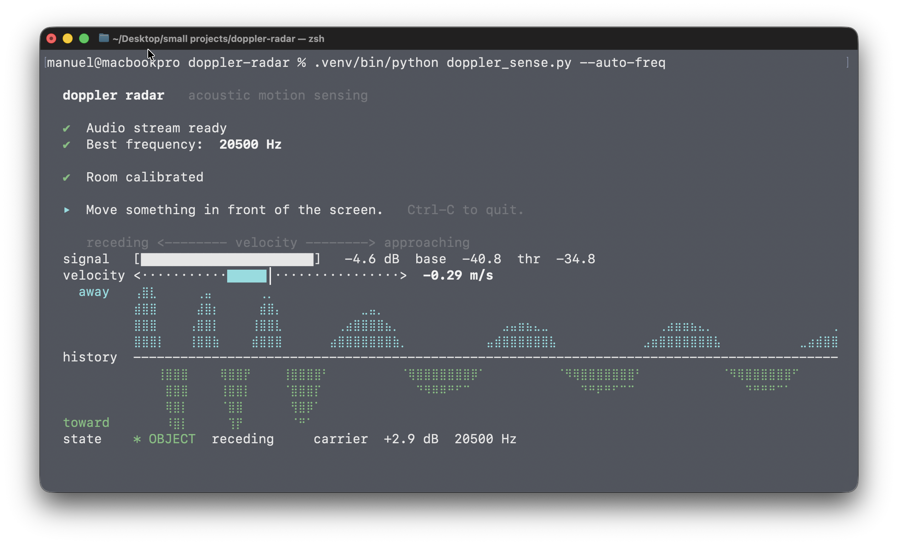

# Detecting motion in front of the screen with the Doppler effect

A friend sent me a video of something like this working. An ordinary laptop with no extra hardware sensing a hand through the speaker and the microphone. Having done some Doppler measurements in university my first reaction was **"there is no way that works"**.

So I vibecoded it in a few minutes to get it out of my system, not believing it for a second and with no intention of this going anywhere. To my surprise, it works pretty well:



## How to make this work on your computer

```bash
git clone https://github.com/malmriv/doppler-radar.git
cd doppler-radar
python3 -m venv .venv
.venv/bin/pip install -r requirements.txt
.venv/bin/python doppler_sense.py --auto-freq
```

Startup takes about 15 seconds. It finds the best carrier (frequency range), waits for the microphone to settle, and calibrates to set the zero correctly. **Keep clear of the screen while it calibrates.** Then move something, such as your hand, in front of it. `Ctrl-C` to quit.

Please make sure of the following!

- **Built-in speakers, with the volume up.** Do not use headphones, use the laptop speakers or standalone speakers. Volume halfway up is enough.
- **The microphone has to stay still.** Keep it on a desk.
- **Grant microphone permission** when the system asks.
- **The room does not need to be quiet.** Ordinary noise such as voices, keyboards, fans, etc. lives below 8 kHz; at 20 kHz there is 37 dB less of it. It is the quietest corner of the spectrum.

Tested on a MacBook Pro. Linux and Windows should behave the same but I have not verified it. If you can verify it, tell me so that I can update this please :)

## The physics

The speaker emits a continuous tone at ~20 kHz, inaudible to just about any adult. (I'm deaf as a post to anything over 16 kHz). The microphone picks it up plus every echo, sound source and all the noise in the room. Anything standing still reflects at the same frequency. Anything moving sends the echo back shifted:

$$\Delta f = \frac{2vf_0}{c}$$

An object moving at 30 cm/s on a 20 kHz carrier gives about 35 Hz. In relative terms that is a rounding error, 0.17 %; but next to a spectral line as clean as the carrier it is a bunch of FFT bins.

The program measures the energy that shows up on either side of the carrier, divides it by the carrier power, and compares the result against the baseline of the still room. That normalisation makes the whole thing immune to the microphone's automatic gain control: when the system raises or lowers the input gain, both the emitted frequency and the reflected frequencies rise and fall together.

Whether the echo comes back above or below the carrier tells you whether the object is approaching or receding. That is all the physics there is here.

## Licence

MIT. Do as you please with it.
